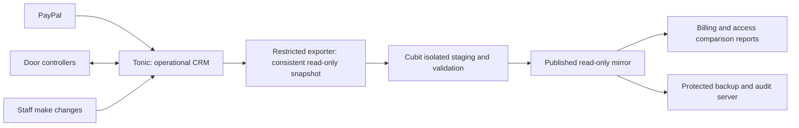

# Cubit alongside Tonic: read-only parallel run

Prepared 2026-09-25. **Proposed implementation, not an enabled connection.**
Tonic remains the operational CRM until the makerspace approves a cutover.
No source credentials, member exports or private server addresses belong in this plan.

## Recommended approach

Run Cubit as a **read-only mirror with comparison reports**. Staff continue making
all membership, payment, plan and key changes in Tonic. Cubit receives consistent
copies of that data and shows where its billing or access calculations disagree.
Neither system writes back to the other during this stage.

Start with a fresh parallel-run database, preserving the current editable review
copy and the separate synthetic demo. Test edits and generated review charges must
not become the baseline for the live-data comparison.

There is no Cubit-to-Tonic, Cubit-to-PayPal or Cubit-to-door control path in this design.
The export reads Tonic's database locally; it does not call Tonic's application endpoints.

## Which system does what

| Area | During the parallel run | Cubit access |
| --- | --- | --- |
| Members, contact details, notes, plans and keys | Staff edit in Tonic | View copied fields that actually exist in the source |
| PayPal collection, subscription changes and payment import | Existing PayPal/Tonic arrangement continues | View transactions already recorded by Tonic; no second live importer or webhook consumer |
| Door whitelist and access decisions | Existing controllers continue using Tonic | View copied events and compare proposed eligibility; never supply a controller whitelist |
| Billing and membership status | Tonic remains the operational source | Show Tonic's values and separately labeled Cubit estimates |
| Unmatched payments and balance cleanup | Record actual changes in Tonic | Identify discrepancies and prepare a correction list; no silent matching or adjustment |
| Member portal | Existing member processes continue | Initially staff-only inspection; keep private portal testing in the existing review workspace |
| Waivers / DocuSeal | Existing signing process continues | View verified source documents only if an export mechanism is confirmed; no new signing requests, uploads or callbacks in the mirror |
| Email and alerts | Existing staff/Tonic processes continue | No automatic email, reminders, reset delivery or notifications to members |
| Cubit sign-in, MFA, staff access, sync health and backups | Managed independently in Cubit | Controlled local administration; these do not alter mirrored business records |
| WordPress, newsletter, forwarding and DNS | Existing services continue | No integration changes needed for the mirror |

## What the current code already provides—and what it does not

- `dev/export-legacy-data.cjs` exports six allowlisted datasets using a consistent,
  read-only InnoDB transaction: members, plans, memberships, transactions, keys and
  access logs. It excludes passwords and includes schema information, row counts
  and a completion marker. It is a useful starting point, not an installed sync job.
- `dev/import-legacy-data.cjs` is a **one-time local review importer**. It requires
  an empty local schema, recalculates charges/statuses and creates test credentials.
  Do not schedule it or adapt it by simply removing the empty-database safeguard.
- `CubitServices/src/dev/config.ts` currently permits specific local/review/demo
  configurations. A separately validated parallel-run mode needs to be added;
  no existing environment flag turns the application into a safe read-only mirror.
- Hosted code in `CubitServices/src/app.ts` blocks `/paypal` and `/ACON`. Keep those
  blocks. The old ACON handlers can log events or update membership information,
  including on GET requests, so they are not safe discovery endpoints.
- `billing/store.ts` has `ensureBilling()` and `refreshAccess()` paths that persist
  charges, balances and statuses. For example, GET `/api/portal` invokes
  `ensureBilling()`. A read-only UI alone would not prevent changes.
- The backup/audit server is connected with restricted credentials and independent
  retention. Extend its coverage to the parallel-run dataset and test that restoration;
  current review-backup success does not automatically prove the new dataset is covered.

## Phase 1 — Confirm the actual operating setup

Do this with the people responsible for Tonic, PayPal and the door controllers.

1. Identify the current Tonic database and schema, source timezone, payment importer
   and its schedule. Confirm how refunds, cancellations and corrections are recorded.
2. Inventory every controller: device, firmware/repository revision, endpoint,
   whitelist cache behavior, refresh interval, offline policy and last successful sync.
   The repository name alone is not evidence of what a particular controller runs.
3. Confirm which fields/documents Tonic really holds. The existing exporter does not
   export staff notes or waiver files; do not promise them until their storage is mapped.
4. Measure a consistent export's duration, size and effect on the old server. Avoid
   peak access periods for the first capture. Do not trigger a PayPal refresh to obtain data.
5. Name the source-system operator, Cubit operator, discrepancy reviewer and cutover
   approver. Store newly scoped credentials in operator-controlled private storage.

**Exit:** approved inventory, field mapping and read-only extraction procedure.
Unknown ownership or controller behavior remains an explicit blocker for that integration.

## Phase 2 — Build and prove the read-only boundary

Add a distinct parallel-run mode before installing a connection to Tonic.

- Start a separate Cubit service/database, with its own authentication audience and
  secrets. Keep the editable review and fictional demo clearly separated. Select an
  unused loopback port and a protected HTTPS route; no new domain purchase is required.
- Split mirrored business data from Cubit's local account/security/operations data.
  The web application's database account gets SELECT access to mirrored tables.
  Only the controlled sync worker can publish imported business records.
- Deny business mutations in the API, including legacy routes and GET handlers with
  side effects. Disable billing posting, access-state mutation, signing/reconciliation,
  payment matching, uploads and provider callbacks. Read-only report downloads remain usable.
- Keep login, MFA, revocation, audit recording, health sampling and operator controls
  on narrowly allowed local write paths. Do not grant imported Tonic roles administrative
  access to Cubit or overwrite Cubit passwords/MFA when refreshing member records.
- Compute Cubit's projected charges and access decisions as versioned comparison
  results, separate from the source mirror. Opening a profile must not change either
  Tonic's data or the mirrored operational state.
- Display a persistent **Read-only mirror** indicator and the source snapshot time.
  Explain that actual corrections must be made in Tonic. Hide or disable misleading
  edit controls, with matching API rejection rather than relying on the browser alone.
- Restrict network access: no PayPal credentials or door-control secrets in this
  service, no route to controller networks, no outbound mail provider access.

**Exit:** tests attempt every business write as both Staff User and Administration;
all are rejected. Representative GET requests leave business-table hashes unchanged.
Normal sign-in, MFA, search, reports, exports and scoped operator tools still work.

## Phase 3 — Establish a one-way feed

Recommended starting cadence: **every 15 minutes**, adjusted after measuring load.
Faster door-log freshness can be a later optimization; this mirror is not an access controller.

1. On the source server, use a dedicated account with SELECT privileges only on the
   needed tables. Configure the exporter explicitly to use it—never fall back to the
   application's unrestricted environment credentials. No public MySQL connection.
2. Export locally in one consistent read-only transaction. Use a unique batch ID,
   schema version, source snapshot timestamp, completion marker, counts and checksums.
   Exclude login secrets, provider credentials and fields not needed for the review.
3. Push the completed file over authenticated encrypted transport to a restricted
   Cubit intake account. Pin the receiver's host key. The account may create intake
   files only: no interactive shell, forwarding, CRM database access or backup-server access.
4. Validate the entire batch in isolated staging: supported schema, file-size limits,
   duplicate IDs, references, date/currency formats, record counts and payment totals
   in integer minor units. Treat imported text/URLs as data; do not execute or fetch them.
5. Publish a validated generation atomically. Readers must never see half a new import
   and half the previous one. Identify rows by source system + original record ID,
   including transaction IDs; email is not an identity key.
6. Make retries idempotent and prevent overlapping jobs. Reject older/out-of-order
   batches. Full snapshots must detect changed old rows, refunds, backdated payments
   and removed records. Do not rely on UUID ordering or a created-date cursor for deltas.
7. Record source removals as explicit tombstones/history only after a complete,
   validated snapshot; never treat a partial file as evidence to delete members.
8. Keep the last good generation on failure. Show sync lag and the failing stage;
   alert the operator through the agreed monitoring channel. Set a visible stale warning
   after two missed 15-minute runs. Track source PayPal import freshness separately
   where available: a fresh copy of Tonic does not prove PayPal itself is current.
9. Bound intake-file retention and storage from the measured export size. Keep a
   recoverable last-good batch plus limited diagnostic history; never accumulate
   unlimited full snapshots. Exports and diagnostics stay out of Git and public logs.

**Exit:** at least a full day of successful cycles, including duplicate delivery,
interrupted transfer, unavailable source/receiver, stale batches and schema-change tests.
Those failure tests use fixtures or a staged source, not deliberate disruption of Tonic.

## Phase 4 — Compare behavior without changing operations

Provide a discrepancy view keyed to a particular snapshot and Cubit calculation version.
Source facts and Cubit estimates must be visibly distinct.

| Comparison | Review method |
| --- | --- |
| Members and memberships | Counts, stable IDs, status, plan dates, multiple open plans, duplicate emails |
| Payments | Exact transaction IDs, amounts, refunds/reversals, timestamps, assignment and unmatched records |
| Billing | Compare stored Tonic balance, reproducible legacy calculation and Cubit projection; explain each difference |
| Access eligibility | Compare Tonic member/key state and Cubit's proposed result, including grace, canceled plans and manual blocks |
| Access events | Preserve event identity, timestamp and recorded decision; check denied/unknown-key handling |
| Waivers, if available | Compare member/document association, provenance, signature status and file checksum |

Use the same as-of instant, organization timezone and ledger currency for comparisons.
Do not invent cancellation dates, missing historical prices or payment matches to make
the totals agree. Keep unresolved cases on a staff review list.

Historical events may identify only a member, not the exact key used. Keep per-key use
as unknown when attribution is missing. A recorded permitted scan is not proof the
physical door opened. Investigate cached-whitelist differences before any door cutover.

Recommended observation period: **one complete monthly billing cycle**, with enough
evidence to cover renewals, cancellation, grace expiry, reinstatement, refunds and
manual key blocks. Use synthetic replay for rare cases rather than altering live members.

**Exit:** every imported ID/payment total reconciles; all billing/access differences
are resolved or explicitly accepted by a named reviewer. No unexplained “Cubit allows /
Tonic denies” result is accepted for door launch.

## Phase 5 — Rehearse cutover and recovery

- Restore the parallel-run database, configurations and needed documents from the
  backup server into an isolated replacement service. Verify both business data and
  staff access without contacting doors, PayPal or email providers.
- Test the future PayPal integration against fixtures/sandbox events, including
  duplicates, refunds, unknown payer matching and a restart during processing.
  Confirm the provider integration and credentials that will actually be used.
- Test each controller type separately: allow/deny behavior, disabled/unknown keys,
  expired/canceled membership, whitelist refresh, offline behavior and logging.
  Do not point operational controllers at the parallel service for these tests.
- Agree final billing cutoffs, opening adjustments and historical-rate exceptions.
  Keep those decisions outside the mirror's authoritative data until cutover.
- Document exact ownership for switching importers/webhooks, controller endpoints,
  public URLs, backups and alerts. Confirm a recovery owner and a rollback decision point.

**Exit:** the relevant [pre-launch gates](../PRE-LAUNCH.md) are signed off, a recovery
rehearsal passes, and the makerspace explicitly approves a cutover window.

## Phase 6 — Switch once, with one writer per integration

1. Take final protected backups and pause staff edits in Tonic for the agreed window.
2. Drain/reconcile Tonic payment processing to a recorded watermark. Preserve incoming
   provider events across the transition; changing the importer must not stop actual
   subscriptions or lose payments received during the window.
3. Capture and validate the final source snapshot, including changes since the last
   parallel cycle. Retain the reconciliation report and source ID mappings.
4. Stop the mirror feed before enabling Cubit business writes. Disable Tonic's
   processing path before enabling Cubit's path, with deduplication across the boundary.
5. Switch and verify controller endpoints in the agreed order while staff are present.
   Check a valid, canceled, manually blocked and unknown key. Confirm new scans reach Cubit.
6. Enable remaining operational features deliberately. Keep Tonic archived/read-only
   during the agreed fallback period, and monitor payments, denied entries and backups.

Rollback before Cubit accepts new business writes can return to the untouched Tonic
workflow. After Cubit has accepted payments or key/member changes, **do not blindly
switch Tonic back on**: reconcile the new records and controller state first so changes
are not lost and two importers do not run simultaneously.

## First implementation work package

1. Add and test the parallel-run mode, database permission boundary and read-only views.
2. Replace the one-time importer with a repeatable staged snapshot publisher that
   preserves IDs and separates staff authentication from mirrored member fields.
3. Add sync history/freshness and the source-versus-Cubit comparison report.
4. Prove all of this with existing private exports and synthetic changes.
5. Only then arrange the restricted source exporter and scheduled feed with the Tonic operator.

No live connection, schedule change, provider setup or controller change is authorized
by this planning document alone. The next implementation stage should explicitly name
the agreed source, credentials' custodian, destination and safety checks.
